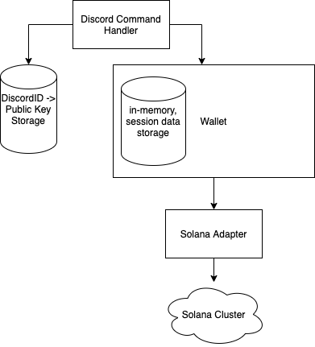

<h1 align="center">Solbot</h1>

<div align="center">
  🏎️🏎️🏎️
</div>
<div align="center">
  <strong>Crypto Tipping Bot for the Solana Discord</strong>
</div>

<br />

<div align="center">
  <a href="https://opensource.org/licenses/MIT">
  </a>
</div>

## Table of Contents
- [Features](#features)
- [Architecture](#architecture)
- [Solana Specifics](#solana-specifics)
- [Deployment](#deployment)

## Features
* send SOL to public keys or by tagging a discord user
* switch between clusters
* check your account balance
* one day (maybe :) ): ledger support, monikers (e.g. send 1 coffee)

### Commands
You can interact with the bot using commands such as `!help`.
In a public channel, you can only use the `!send` command.
You can use **all** commands in a private DM channel with the bot.

## Architecture


#### Discord Command Handler
This component faces the user and accept commands which it forwards to the other components.
#### DiscordId -> Public Key Storage
This is a persistent db. All it does is map discordIds to public keys. A user can use a command
to save a public key for their discordId here. Then, users can send that user currency by simply
tagging them in a message instead of having to write the public key.
#### Wallet
Regular wallet offering functions such as inspecting balance or sending currency. Forwards calls to
the selected Solana cluster. Saves private key in memory while user is logged in.
#### PriceAPI
Provides the current USD value of SOL and some other price-related functions.

## Solana Specifics
If you're interested in the specifics of using Solana,
check out the `solana` package inside the `src` folder.

#### Connection

The main entrypoint to the cluster is the [Connection](https://solana-labs.github.io/solana-web3.js/class/src/connection.js~Connection.html) 
on which methods such as `getBalance` or `sendTransaction` can be called. When creating a connection,
you can specify a [Commitment](https://solana-labs.github.io/solana-web3.js/typedef/index.html#static-typedef-Commitment) which tells
the connection which slot to query when making a request e.g. when calling getBalance on a connection with commitment === `max`, it will
return the balance of the given account in the latest finalised slot.

#### Convenience functions

The solana js library also provides a range of convenience functions to make common workflows
easier to code e.g. `web3.clusterApiUrl` to convert a cluster name  such as `mainnet-beta` to
the url to connect to.

#### Transferring funds

Generally, all apps that want to interact with a Solana need to send transactions to it,
that can include multiple instructions. These instructions are forwarded to [programs](https://docs.solana.com/apps#instructions)
deployed on-chain (each transaction references a programId that specifies which program
should process the instruction).

All this holds true even for transferring funds and again the solana library provides
helper functions for it. Specifically, we can use `web3.SystemProgram.transfer` to create
a transaction that will be sent to the [System Program](https://github.com/solana-labs/solana/blob/master/runtime/src/system_instruction_processor.rs)
which then adjusts account balances. The created transaction can then be sent using `web3.sendAndConfirmTransaction`.

## Deployment

### Discord Setup

1. Go to the discord developer portal and create a new application
2. Create a new bot. You can also give it an avatar. You'll need the bot token for later!
3. Go to `https://discord.com/oauth2/authorize?client_id=<YOUR_APPLICATION_CLIENT_ID>&scope=bot` to add the bot to your server.

### Local Deployment

1. Start a local postgresql for the Public Key Storage 

    ```
    docker run -d -p 5432:5432 -e POSTGRES_USER=tipping-bot -e POSTGRES_PASSWORD=tipping-bot-postgresql -e POSTGRES_DB=tipping-bot-postgresql --name tipping-bot-postgresql postgres:12.4-alpine
    ```

2. add a new `secret` folder inside `src`, add an `.env` file inside with the following content (DO NOT COMMIT THIS FILE):
   ```
   DISCORD_TOKEN=<YOUR_BOT_TOKEN>
   ```
   
3. run `npm install`
4. run `npm run migrate`
5. run `npm start`

### Cloud Deployment

- Whatever deployment provider you choose, you will need
    - a postgres db
    - a node runtime
- The following environment variables should be set
    - NODE_ENV: "production"
    - DISCORD_TOKEN: <YOUR_BOT_TOKEN>
    - PROD_DB_USERNAME: <YOUR_DB_USERNAME,
    - PROD_DB_PASSWORD: <YOUR_DB_PASSWORD>,
    - PROD_DB_NAME: <YOUR_DB_NAME>,
    - PROD_DB_HOST: <YOUR_DB_HOST>,
    - PROD_DB_PORT: <YOUR_DB_PORT>,

1. With the above steps completed, you can start with `npm install`
2. Then run `npm run migrate`
3. Then run `npm start`
